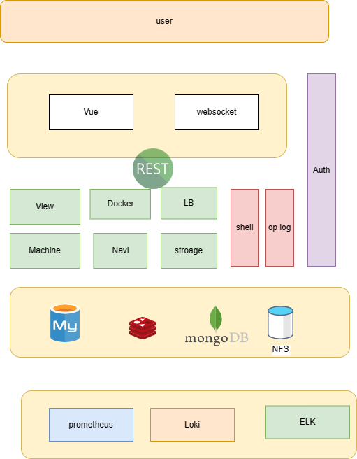

<div align="center">
  
  <h1>Xops </h1>
   <span><a href="./README.md">English</a> | 中文</span>
</div>

## 介绍

xops目标是链接开发和运营的管理平台，使用比较新的技术栈完成通用模块的开发。前后端尽量会适配不同语言，供大家参考学习！

### 版本

测试阶段

## 开发

```bash
# 版本
1. node 版本 16+

# 克隆项目
git clone https://github.com/cilliandevops/xops.git

# 进入项目目录
cd xops/xops-fe

# 安装依赖
pnpm i

# 启动服务
pnpm dev
```

## 技术栈

### 前端

框架：vue3

语言：typescript

构建：vite

UI组件：elmentplus/antd

### 后端

语言：golang/python/java

框架：gin/django/sprinboot

数据： gorm/sqlqlchemy/mybatisplus

### 功能模块

- 传统模块
- 云原生模块
- AIops模块

### 详细介绍

- 前端部分
- 后端部分
- 数据部分
- 部署


### 架构




个人博客：

<www.cillian.website>
